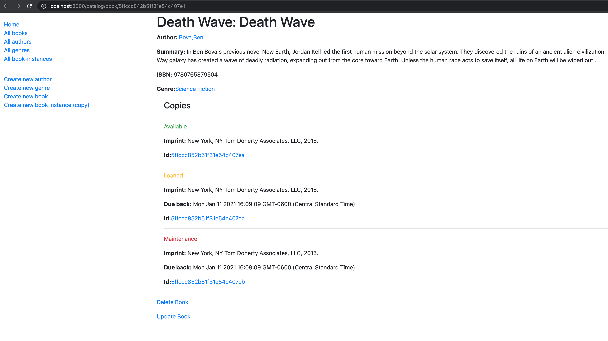

# LOCAL LIBRARY
>  A basic Express website developed as a tutorial example on the Mozilla Developer Network.



## Table of Contents

* [Features](#features)
* [Installation](#installation)
* [Built With](#built-with)
* [Contributing](#contributing)
* [Acknowledgments](#acknowledgments)
* [Authors](#author)
* [License](#license)

## Features

- A user can get a list of authors, books, book instances (book availability), and genres.
- A user can get a single author, book, book instance, or genre.
- A user can create a new author, book, book instance, or genre.
- A user can delete authors.
- A user can update books.

## Installation

You can get a local copy of the repository please run the following commands on your terminal:
```
$ cd <folder>
$ git clone git@github.com:dansantander/locallibrary.git
$ npm install
$ npm start
```

## Built With

- Express JS
- Node JS
- Mongoose
- Nodemon
- Pug

## Contributing

Contributions, issues and feature requests are welcome!

You can do it on [issues page](issues/).

## Acknowledgments

Special thanks to code reviewers.

## Show your support

Give a ⭐️ if you like this project!

## Authors

👤 **Daniel Santander**

- Github: [@dansantander](https://github.com/dansantander)
- Linkedin: [Daniel Santander](https://www.linkedin.com/in/daniel-santander)
- Twitter: [@dansantandr](https://twitter.com/dansantandr)

## License

<strong>Creative Commons 2020</strong>